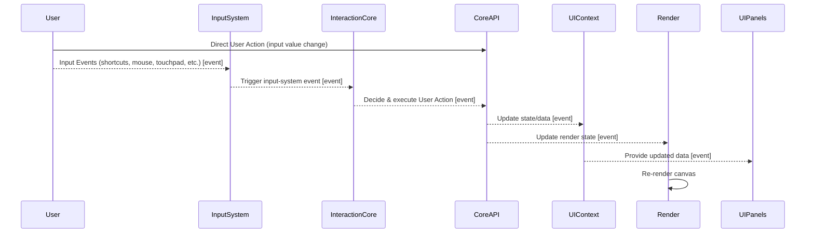

## ✅ Requirements and Design Considerations

Adding a new feature in a CDD-based architecture requires clear communication, modular design, and event-driven collaboration across multiple repositories. The goal is to implement functionality that is decoupled, testable, and easily maintainable, while enabling participation from diverse roles including PMs, designers, developers, and AI agents.

Key considerations include:

- Defining clear requirements with input from PM and designers
- Planning the involved contexts and repositories
- Designing the event and data flow for the feature
- Keeping business logic out of the `core` repository to maintain separation of concerns
- Leveraging event-based communication for cross-repo collaboration

---

## 🗂️ Involved Repos

`ui-context`, `core` , `feature-repo` (e.g., `selection`, `undo-redo`), `reactive-events`, `ai-agent`

---

## 🔁 Event Flow and Data Flow Design

The feature is implemented by defining an event-driven workflow:

1. **User Action / PM Request** triggers an event, e.g. `FEATURE_ADD_REQUEST`
2. The `feature-repo` listens and processes this event, updating its internal state
3. Upon state change, it emits a `FEATURE_UPDATED` event
4. The `ui-context` listens and updates the UI accordingly
5. AI agents can listen to the same events to provide suggestions or automations



## 🔽 Event-Driven Collaboration Across Repositories

In this architecture, **all interactions between repositories happen through an event-driven flow**. This design ensures loose coupling and scalability. Here's a breakdown of the key steps:

1. **User Actions**  
   Users trigger changes either by directly interacting with UI inputs (e.g., input fields) or via input devices (mouse, keyboard shortcuts, touchpad) on the canvas.

2. **Input System & Event Emission**  
   All input events are captured and dispatched as events by the **Input System**. This includes keyboard shortcuts, mouse clicks, and touch gestures.

3. **Interaction Core Decides Actions**  
   The **Interaction Core** listens for these input events and decides which user action should be executed. It then emits an event representing this decision.

4. **Core API Executes Actions and Updates State**  
   The **Core API** listens for these user action events and executes the relevant logic, updating the application state accordingly.

5. **UI Context and Rendering React**  
   Both **UI Context** and **Render** repositories listen for state changes and update their data and views accordingly.

6. **UI Panels Display Finalized Data**  
   Finally, **UI Panels** subscribe to the UI Context to display the updated information to the user.

This flow, illustrated in the sequence diagram above, highlights the power of event-driven communication in maintaining clear separation of concerns while enabling robust collaboration across multiple modules.

## 🔽 Example Code Snippet

Below is a simplified example demonstrating how to add a new feature event and handle it across multiple repositories following the CDD event-driven flow:

```typescript
// User triggers a new feature request (e.g., press arrow keys to move element)
inputSystem.on(
  InputSystemEvents.INPUT_SHORTCUT_ARROW_UP,
  (raw: RawInputEvent) => {
    // Update key state context
    this.deps.updateKeyState({
      ...(raw.modifiers as ModifierKeys)
    })

    // then execute interaction-core api to decide next user action
    this.deps.startSession(InputSystemEvents.INPUT_SHORTCUT_ARROW_UP)
  }
)

// Create behavior and rules for InputSystemEvents.INPUT_SHORTCUT_ARROW_UP in interaction-core
const decideArrowMoveBehavior = (
  systemContextSnapshot: SystemContextSnapshot
): InteractionEvent => {
  return decideArrowMoveRules(systemContextSnapshot.key)
}

const decideArrowMoveRules = (keySnapshot: KeySnapshot): InteractionEvent => {
  const interaction: InteractionEvent = {
    type: InteractionActions.INTERACTION_ARROW_MOVE,
    payload: {
      dir: MoveDirection.UP,
      delta: keySnapshot.shift ? 10 : 1
    }
  }

  return interaction
}

// Add events for new user action in reactive-events
interface MoveElementEvent {
  type: EventTypes
  payload: {
    dir: MoveDirection
    delta: number
  }
}

const decideToMoveElement = (dir: MoveDirection, delta: number) => {
  publishEvent({
    type: EventTypes.DECIDE_TO_CREATE_ELEMENT,
    payload: {
      dir,
      delta
    }
  })
}

const subscribeToDecideToMoveElement =
  createSubscribeEvent<DecideToMoveElementEvent>(
    EventTypes.DECIDE_TO_MOVE_ELEMENT
  )

// User action API in core
const createShotcutAPIs = (): ShortcutActionAPIs => {
  return {
    moveElements(dir: MoveDirection, delta: number) {
      // Update element position with delta in dir
      startTransaction()
      const elementIds = await requestElementSelection()
      const key =
        dir === MoveDirection.UP || dir === MoveDirection.DOWN ? 'y' : 'x'

      changeComputedDataInDelta(elementIds, key, delta)
      endTransaction()
    }
  }
}

// Subscribers in core for interaction-core
const initShortcutHandlers = (apis: ShortcutActionAPIs) => {
  subscribeToDecideToMoveElement(({ payload }) => {
    apis.moveElements(payload.dir, payload.delta)
  })
}
```

This pattern ensures all repos remain decoupled yet responsive through events, preserving modularity and scalability.

---

## 🤖 How AI Agents Participate

AI Agents can integrate seamlessly into the event-driven system without altering any core logic. They do so by **subscribing to specific events** across the workflow and reacting accordingly.

## 🔽 Example Use Cases

- **Monitoring**  
  Subscribe to events such as `FEATURE_ADD_REQUEST`, `ACTION_EXECUTED`, or `STATE_CHANGED` to track user activity and system state.

- **Assistance**  
  Suggest improvements or generate code snippets when a user starts defining a new feature, or validate inputs automatically before execution.

- **Automation**  
  Automatically trigger downstream workflows (e.g., commit code, notify team, update test plans) once a feature is fully defined and committed.

This design allows AI agents to behave just like any other subscriber within the system:

By following the same observer pattern as internal modules, AI agents become first-class participants in the design tool without increasing coupling or complexity.

---

## 👉 **What’s Next?**

Now that we’ve seen how the Feature module is built using the core event-driven architecture, we’ll apply the same principles to walk through the implementation of the Selection system.
