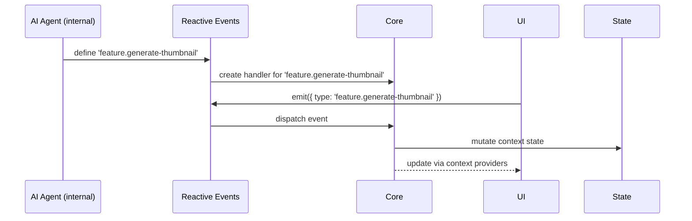
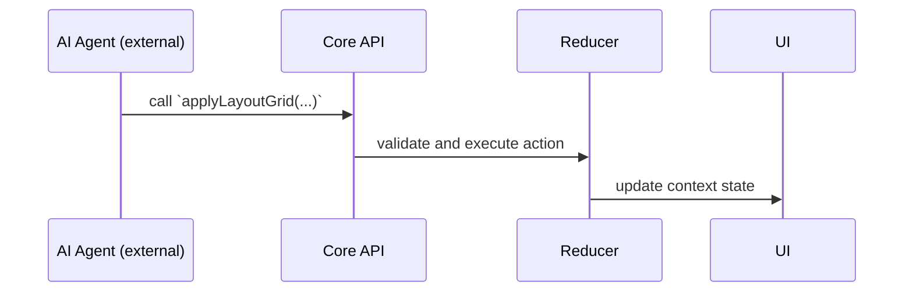

In the CDD architecture, AI agents are treated as **intent emitters** and **state observers**, integrated via the same event pipeline and API interfaces as human users. We support two types of AI agents with distinct responsibilities and boundaries.

---

## 🤖 Two Types of AI Agents

1. **Development AI Agents**  
   Internal agents that assist with building the product (e.g. generating tools, automating workflows).

   - Can emit new domain-specific events to `reactive-events`
   - Can create new handlers and APIs in `core`
   - Capable of helping humans design or extend the system itself

2. **User-Facing AI Agents**  
   External agents (e.g. via MCP) that assist end users with tasks.
   - Cannot mutate system architecture
   - Can only call public APIs exposed by `core`
   - Must follow the same permission, access, and validation pipeline as human actions

---

## 🗂️ Involved Repos

`core`, `reactive-events`, `ai-agent` (in future), `system-context`

---

## 🔁 Event & Execution Flow

This flow diagram shows how **Development AI Agents** can introduce new capabilities to the system:

In contrast, **User-Facing AI Agents** interact with the system through pre-defined APIs only:

---

## 🧱 Design Principles

To keep both AI types safely decoupled from core logic:

- Internal AI agents contribute to the **event definition layer**
- External AI agents interact only through **explicit public APIs**
- No AI can directly mutate shared state—they always go through the same reducers and validators
- All actions are observable, reversible, and trackable

---

## 🧠 Summary

- AI is a **first-class participant** in the CDD system—no backdoors or privileged shortcuts
- Internal AIs help evolve the system by working through `reactive-events` and `core`
- External AIs (via MCP) operate safely within API boundaries
- This makes AI a modular, testable, and predictable part of your architecture
