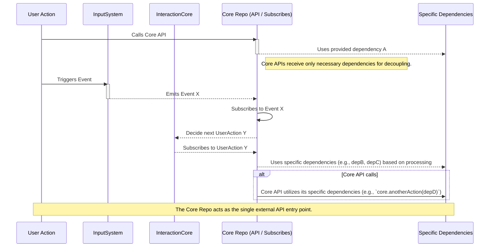

## ✅ Requirements and Design Considerations

- [x] Keep `core` strictly as a communication and orchestration layer
- [x] Avoid embedding any business logic or domain-specific rules in `core`
- [x] Ensure `core` provides only minimal APIs and event handling mechanisms
- [x] Promote separation of concerns by pushing logic to dedicated repos (e.g. `features`, `tools`)
- [x] Enable easy testing, replacement, and independent evolution of business logic
- [x] Support AI agents to observe and trigger events through `core` without internal logic interference

---

## 🗂️ Involved Repos

`core`, `feature-*` (feature-specific repos)

---

## 🔁 Event and Data Flow Design

`core` acts as a lightweight event bus and coordination hub. It receives UI events or commands, forwards them as standardized events, and relays results back to the UI or other repos. Business logic such as validation, state updates, or side effects are handled entirely by downstream feature repos or tools.

This separation is visualized in the following event sequence:

---

## 🧱 Module Partition and Decoupling Strategy

The `core` repo is intentionally designed without business logic. Instead, it acts as a central coordinator that exposes public APIs and listens to events. All real processing is delegated to external modules through explicit dependencies, promoting strong decoupling and testability.

Here’s how the modules are separated:

- **`core`**  
  Acts as the only external API surface. It:

  - Exposes clearly defined methods for user-driven operations.
  - Subscribes to events from other systems (e.g., InputSystem).
  - Does not store business state or maintain internal logic.
  - Accepts injected dependencies (e.g., `depA`, `depB`, `depC`) to perform real actions.

- **`InputSystem`**  
  Handles raw user inputs from devices such as keyboard, mouse, or touchpad.  
  It translates low-level input signals into normalized events (e.g., `EventX`) and emits them to the system.  
  It does not execute or call any business logic, and is not aware of what the events will trigger.

- **`InteractionCore`**  
  Receives normalized input events and the current system state from `core`.  
  It interprets these signals to determine the next high-level user intent (e.g., `UserActionY`).  
  Instead of returning results directly, it emits the decided action via the event bus.  
  `core` listens to these emitted actions and responds by executing the appropriate logic.

- **Dependencies**  
  Are passed explicitly into the `core` API functions, or injected during setup. These could be actions like selection management, undo history, state updates, or domain-specific modules. The key point is: all real logic lives outside of `core`.

By maintaining this structure:

- Testing `core` becomes trivial because all dependencies can be mocked.
- You can scale the system without modifying `core` itself.
- `AI agents`, tools, or external callers only need to talk to `core` without understanding the rest of the internals.
- No module relies on global singletons or hidden state transitions.

---

## 🤖 How AI Agents Participate

AI agents interact with this architecture mainly via `core` by:

- Observing raw user input events or state changes propagated through `core`
- Injecting commands or events to simulate user actions or automate workflows without touching business logic
- Analyzing event streams to generate higher-level decisions or recommendations
- Triggering feature repos indirectly by sending well-defined events to `core`

Because `core` is logic-free, AI agents can safely operate on communication channels without risking unexpected side effects or conflicts with domain rules.

---

## 📌 Summary

- `core` is the **communication backbone**, not a business rules engine
- Business logic resides exclusively in feature-specific repos
- Event-driven flows promote loose coupling and clear separation of concerns
- AI agents leverage `core` to participate seamlessly without entangling logic
- This architecture scales well for large teams and complex domain needs
