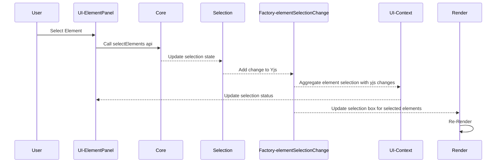

The selection system is one of the most essential interactive features in any design tool. In our CDD-based architecture, we designed the selection logic to be decoupled, scalable, and context-driven—making it easy to evolve and extend, especially with AI agents and collaborative scenarios.

This document explains how we implemented selection in practice, and how the architecture promotes modularity and clear communication.

---

## ✅ Requirements and Design Considerations

Before implementation, we clarified the concrete requirements:

- [x] Click on UI Panel to select a single element
- [ ] Click on Canvas to select a single element
- [ ] Shift + click to select multiple elements
- [ ] Drag to box-select a region
- [ ] Keyboard-driven selection (e.g., Cmd+A)
- [x] Clear selection via click-away
- [ ] Clear selection via tool switch
- [x] Update selection consistently across canvas, scene tree, and property panel
- [x] Share selection state across modules without tight coupling

---

## 🗂️ Involved Repos

`core`, `reactive-events`, `selection`, `ui-context`, `factroy`, `input-system`, `render`, `ui`

---

## 🔁 Event Flow Overview

Selection updates are driven by events and reactive flows. Here's a high-level view of how a box-selection happens:



---

## 🖼️ UI Rendering of Selection

The `selection` state is bridged into the React UI through the `ui-context` repository, which exposes a React context or hooks for components to consume.

`factory` handles yjs changes for `ui-context` and `render`

`ui-context` listens for updates from the `factory` selection yjs changes object and triggers re-renders of relevant UI parts, such as the selection highlights in the canvas or the selected items shown in the element panel.

The `render` repo is responsible for the visual representation of the selection, including drawing the selection box and visual outlines.

## 🔽 Example Hook Usage

```tsx
// In UI data providers
const useElementSelection = (): Set<string> =>
  createStore(uiContext.elementSelection)

// In Element Panel
const elementSelection = useElementSelection()

<Element
  elementId={elementId}
  isSelected={elementSelection.has(elementId)}
/>
```

This pattern ensures a clean separation:

- `selection` manages the state
- `factory` handles selection changes
- `ui-context` provides reactive hooks and context
- `render` handles the actual drawing

---

## 🧱 Decoupling and Modularity

The selection system separates state (`selection` repo) from UI context (`ui-context`) and rendering (`render`) logic. This decoupling:

- Keeps feature logic focused and maintainable
- Makes it easier to swap or extend behavior without affecting unrelated modules
- Encourages collaboration, since each team can work within a clearly scoped repo

Even with minimal features, the modular structure reflects how CDD encourages clean boundaries and iterative growth.

---

## 📌 Summary

- The selection system is centered on a single reactive source of truth
- The system is extendable by design—new interactions, AI agents, and remote collaboration require no refactoring
