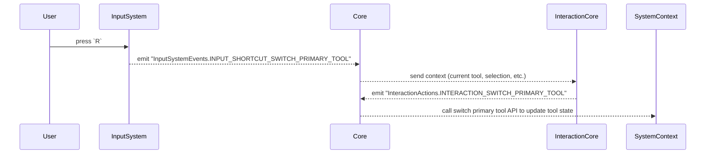

In a CDD system, tools are not command handlers — they are **states representing user intent**. The logic that defines "what to do" does not live inside the tool object, but rather flows through clearly defined event chains across different system layers. This section demonstrates how user input becomes meaningful action in a decoupled, observable, and AI-accessible manner.

---

## ✅ Requirements and Design Considerations

- [x] Allow switching tools using keyboard shortcuts
- [x] Decouple input triggers from tool logic
- [x] Let core layer stay agnostic of UI or input devices
- [x] Allow AI agents to switch tools programmatically
- [x] Make the tool-switch flow traceable and testable

---

## 🗂️ Involved Repos

`input-system`, `core`, `interaction-core`, `system-context`

## 🔁 Event Flow Overview

The system treats **input** as a signal, **not** a command. Here's how we interpret a keyboard shortcut into an actual tool switch.

- A shortcut key (e.g. `R` for CreateRectangle Tool) is pressed
- `input-system` emits an event like `InputSystemEvents.INPUT_SHORTCUT_SWITCH_PRIMARY_TOOL`
- `core` receives this input-level event and wraps it with current system state (e.g. current selection, current tool, cursor status)
- The event is forwarded to `interaction-core`, which interprets it into a **user action** like `InteractionActions.INTERACTION_SWITCH_PRIMARY_TOOL`
- `interaction-core` emits this user action
- `core` listens for this action and calls the corresponding API

---

## 🔽 Example Sequence



---

## 🧱 Module Boundaries and Decoupling

The system is **intentionally split** into the following layers:

- `input-system` only maps device input → generic input events
- `core` is the mediator and state packager
- `interaction-core` is the **intent engine** — it interprets state and input to propose a user action
- `system-context` is a standalone module that manages tool state — **without owning business logic**

This design ensures tools remain **testable, scriptable, observable**, and easy to integrate with AI.

---

## 🤖 How AI Agents Participate

AI agents do **not** need to simulate keypresses or mutate state directly.  
They can simply execute the same action with the same InputSystemEvent:

```typescript
this.deps.executeAction(
  InputSystemEvents.INPUT_SHORTCUT_SWITCH_PRIMARY_TOOL,
  detail // pass the detail which can represent the action you want
)
```

This will flow through the same pipeline, keeping behavior **predictable and observable**, even for non-human actors.

---

## 🎯 Takeaways

- Tool switching is modeled as **intent**, not command
- We keep layers focused: input → intent → action → API → state
- No module assumes full control — each layer transforms the signal
- Tools themselves hold no logic — just identity and config
- AI and humans use the **same pipeline** to trigger actions
