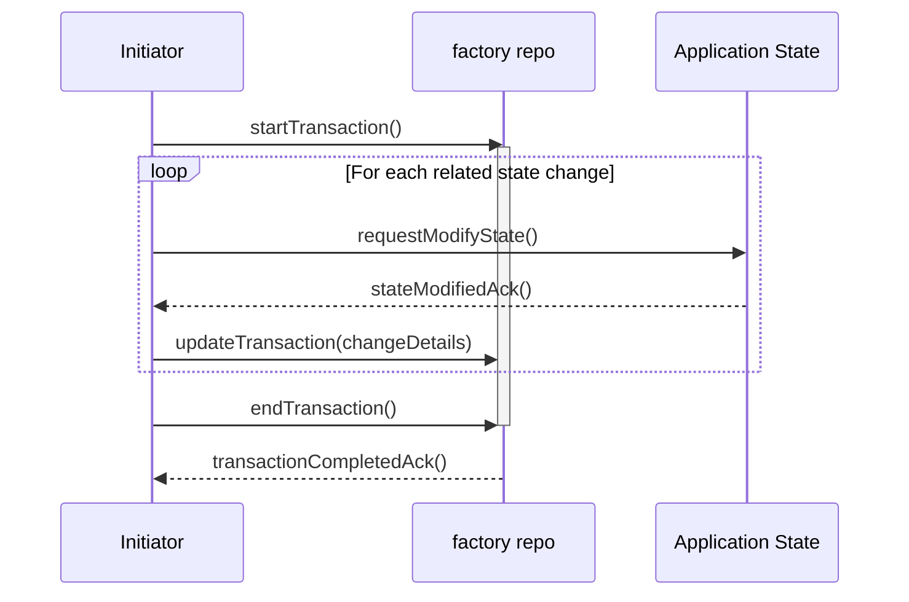

# How We Handle Undo/Redo

Undo/Redo is a core feature in any collaborative design tool. In CDD, our approach prioritizes **clarity of intent**, **separation of concerns**, and **AI-friendly traceability**. This example walks through how undo/redo is implemented as a communication pattern, not just a command stack.

## ✅ Requirements and Design Considerations

- [x] Users can undo any state-changing operation
- [x] Redo is only valid right after undo, and is cleared on any new operation.
- [x] Operations are grouped by transaction, not per-action
- [x] Works across distributed contexts (scene tree, props, selection)
- [x] Maintains consistent state across multiple collaborators
- [ ] AI agents can understand and describe undo/redo actions

## 🗂️ Involved Repos

`core`, `factory`, `reactive-events`

## 🔁 Event & Data Flow

The undo/redo system is orchestrated through a centralized transaction lifecycle managed by the `factory` repo.

Any state change that should be undoable must explicitly inform the `factory` to **start a transaction** (`startTransaction`), **relay all changes** through `updateTransaction`, and **signal the finalization** of the batch with `endTransaction`.

The `factory` itself **does not initiate state changes**. Instead, upon `startTransaction`, it prepares to group incoming changes. During `updateTransaction`, it **records the external state changes** as they occur. Finally, `endTransaction` signals that the batch of changes is complete, allowing `factory` to group multiple related operations into a single transaction entry, making complex undo/redo scenarios predictable and efficient.

Diagram:

## 🧱 Modularity & Decoupling Strategy

- `core` does not handle history logic — it only forwards user actions.
- `factory` stores a clean stack of transactions with metadata and diffs.
- Each repo is responsible for computing and applying its own diff.
- Repos communicate through standardized events, not direct calls.
- `undo()` and `redo()` are just event triggers — no magic command pattern.

This lets us easily decouple state storage from the mutation logic, allowing future replacement (e.g., CRDT support or conflict resolution layer).

## 📌 Summary

Undo/Redo is not a command stack, but a communication process. CDD's transaction-based architecture ensures each operation is tracked, grouped, and reversible — even across distributed systems. More importantly, it creates a transparent system for humans _and_ AI to collaborate effectively.
